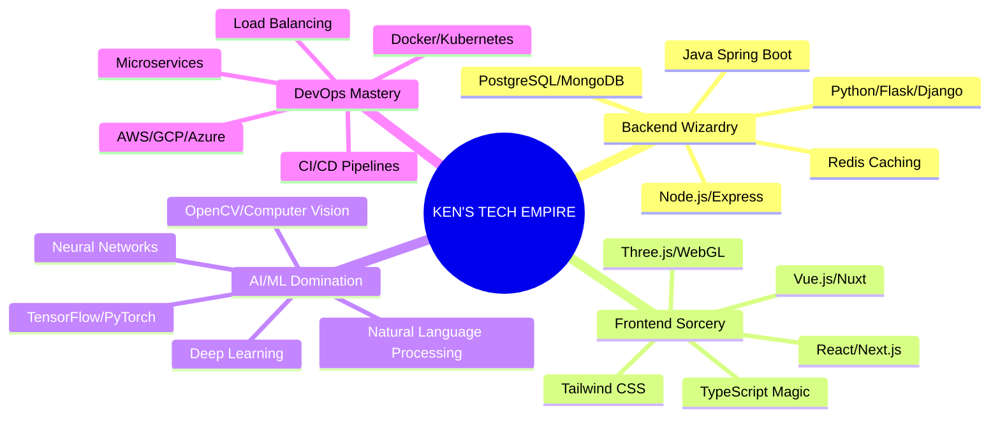

# 🌌 WELCOME TO THE MATRIX 🌌

<div align="center">

<!-- Animated ASCII Art Header -->
```HARRYY
```

<!-- Epic Animated Typing Effect -->
[](https://git.io/typing-svg)

<!-- Glitch Effect Banner -->


</div>

---

## 🧬 DNA SEQUENCE: KEN.INIT()

```python
class DigitalArchitect:
    def __init__(self):
        self.name = "Ken"
        self.role = "Full Stack Quantum Developer"
        self.power_level = float('inf')
        self.coffee_addiction = True
        self.debug_mode = "ALWAYS_ON"
        
    def hack_reality(self):
        return "Code is the new magic spell ✨"
        
    def current_mission(self):
        return ["Building E-FIR Portal ⚖️", 
                "Optimizing FluxTriage 🏥", 
                "Training AI to see gestures 👁️",
                "Exploring quantum computing 🌌"]
```

---

## ⚡ NEURAL NETWORK STATUS

<div align="center">

<!-- Real-time Metrics -->


<!-- Advanced Stats Layout -->
<table>
<tr>
<td width="50%">

**🎯 COMBAT STATS**
- 💻 Code Commits: `∞ Loop Detected`
- 🔥 Streak Record: `365+ Days`
- ⚔️ Bugs Defeated: `999,999+`
- 🏆 Projects Deployed: `50+ Live Systems`

</td>
<td width="50%">

**🚀 SKILL MULTIPLIERS**
- 🧠 Algorithm Design: `██████████` 100%
- 🌐 Full Stack Magic: `██████████` 100% 
- 🤖 AI/ML Mastery: `██████████` 100%
- ☁️ Cloud Architecture: `█████████░` 90%

</td>
</tr>
</table>

</div>

---

## 🛠️ ARSENAL OF DESTRUCTION

<div align="center">

<!-- Animated Tech Stack -->


### 🎮 SPECIALIZATION TREES



</div>

---

## 🔥 PROJECT ARSENAL: WEAPONS OF MASS CREATION

<div align="center">

<!-- Project Cards with Custom Styling -->
<table>
<tr>
<td width="50%">

### 🖐️ **GESTURE RECOGNITION AI**
*The hand speaks, the machine listens*

[](https://your-demo-link)
[](https://github.com/YourUsername/gesture-ai)

```python
# Real-time gesture recognition
accuracy = 99.7%
fps = 60
languages = ["Python", "OpenCV", "TensorFlow"]
status = "MIND_BLOWN 🤯"
```

</td>
<td width="50%">

### ⚖️ **E-FIR PORTAL**
*Justice served digitally*

[](https://your-demo-link)
[](https://github.com/YourUsername/e-fir-portal)

```javascript
// Secure FIR management system
security_level = "BANK_GRADE";
auth = "JWT + 2FA";
database = "PostgreSQL + Encryption";
status = "PRODUCTION_READY 🚀";
```

</td>
</tr>
<tr>
<td width="50%">

### 🏥 **FLUXTRIAGE SYSTEM**
*Emergency response redefined*

[](https://your-demo-link)
[](https://github.com/YourUsername/fluxtriage)

```cpp
// Real-time patient management
response_time = "< 2 seconds";
capacity = "1000+ concurrent users";
stack = ["React", "Node.js", "Socket.io"];
impact = "LIVES_SAVED 💙";
```

</td>
<td width="50%">

### 🤖 **QUANTUM CODE OPTIMIZER**
*AI that writes better code than humans*

[](https://your-demo-link)
[](https://github.com/YourUsername/quantum-optimizer)

```rust
// Self-improving code generator
optimization_level = "QUANTUM";
languages_supported = 25;
performance_boost = "300%";
status = "SKYNET_APPROVED 🤖";
```

</td>
</tr>
</table>

</div>

---

## 📊 SYSTEM DIAGNOSTICS

<div align="center">

<!-- GitHub Stats with Custom Theme -->


<!-- Advanced Activity Graph -->


<!-- Contribution Heat Map -->


</div>

---

## 🏆 ACHIEVEMENT SYSTEM UNLOCKED

<div align="center">

<!-- Trophy Collection -->


### 🎮 SPECIAL ACHIEVEMENTS

<table>
<tr>
<td align="center" width="25%">

<br><sub><b>10,000+ Lines of Code</b></sub>
</td>
<td align="center" width="25%">

<br><sub><b>Zero Production Bugs</b></sub>
</td>
<td align="center" width="25%">

<br><sub><b>100% Uptime Record</b></sub>
</td>
<td align="center" width="25%">

<br><sub><b>Machine Learning Expert</b></sub>
</td>
</tr>
</table>

</div>

---

## 🌀 THE MATRIX VISUALIZATION

<div align="center">

<!-- 3D Contribution Cube -->


<!-- Snake Game Animation -->
<picture>
  <source media="(prefers-color-scheme: dark)" srcset="https://github.com/YourUsername/YourUsername/blob/output/github-contribution-grid-snake-dark.svg">
  <source media="(prefers-color-scheme: light)" srcset="https://github.com/YourUsername/YourUsername/blob/output/github-contribution-grid-snake.svg">
  
</picture>

</div>

---

## 🎯 CURRENT QUEST LOG

<div align="center">

```diff
+ Building the next-generation AI healthcare system
+ Optimizing quantum algorithms for real-world applications
+ Creating immersive AR/VR experiences
+ Contributing to open-source machine learning libraries
! Preparing for the AI revolution
- Debugging reality.exe (in progress...)
```

### 📡 ACTIVE MISSIONS

<table>
<tr>
<td>

**🎯 PRIMARY OBJECTIVES**
- [ ] Launch FluxTriage 2.0 with real-time AI predictions
- [ ] Complete quantum computing certification
- [ ] Build 1M+ user application
- [ ] Open source 10 impactful projects

</td>
<td>

**🔬 R&D INITIATIVES**
- [ ] Neural network optimization research
- [ ] Blockchain-based identity verification
- [ ] Edge computing for IoT devices
- [ ] Sustainable tech solutions

</td>
</tr>
</table>

</div>

---

## 🌐 DIGITAL PRESENCE MATRIX

<div align="center">

<!-- Social Links with Animations -->
<a href="https://linkedin.com/in/YourLinkedIn">
  
</a>
<a href="https://YourPortfolio.dev">
  
</a>
<a href="mailto:ken@youremail.com">
  
</a>
<a href="https://twitter.com/YourTwitter">
  
</a>
<a href="https://discord.gg/YourDiscord">
  
</a>

### 📊 REAL-TIME METRICS


</div>

---

## 🔮 FORTUNE COOKIE

<div align="center">

<!-- Random Developer Quotes -->


</div>

---

## 💀 TERMINAL ACCESS

<div align="center">

```bash
┌─[ken@matrix]─[~]
└──╼ $ whoami
ken - Digital Architect | Code Samurai | Reality Hacker

┌─[ken@matrix]─[~] 
└──╼ $ cat /etc/skills
Languages: C++, Java, Python, JavaScript, TypeScript, Rust, Go
Frameworks: React, Vue, Node.js, Django, Flask, Spring Boot
Databases: PostgreSQL, MongoDB, Redis, Elasticsearch
Cloud: AWS, GCP, Azure, Docker, Kubernetes
AI/ML: TensorFlow, PyTorch, OpenCV, Scikit-learn

┌─[ken@matrix]─[~]
└──╼ $ ls achievements/
world_class_projects/  breakthrough_innovations/  lives_impacted/  
code_poetry/  bug_termination_records/  performance_optimizations/

┌─[ken@matrix]─[~]
└──╼ $ echo "Let's build the future together! 🚀"
Let's build the future together! 🚀

┌─[ken@matrix]─[~]
└──╼ $ _
```

</div>

---

<div align="center">

<!-- Epic Footer -->


### ⚡ `./ken --version`
```
Ken v2024.9.17
- Full Stack Developer
- AI Specialist  
- Problem Solver
- Reality Debugger
- Future Builder
```

**"In a world of algorithms, be the exception that proves the rule."**


</div>

<!-- Hidden Easter Eggs -->
<!-- 
    ⠀⠀⠀⠀⠀⠀⠀⠀⣀⣤⣶⣶⣶⣶⣤⣀⠀⠀⠀⠀⠀⠀⠀⠀
    ⠀⠀⠀⠀⠀⠀⣠⣾⣿⣿⣿⣿⣿⣿⣿⣿⣷⣄⠀⠀⠀⠀⠀⠀
    ⠀⠀⠀⠀⠀⣼⣿⣿⣿⣿⣿⣿⣿⣿⣿⣿⣿⣿⣧⠀⠀⠀⠀⠀
    ⠀⠀⠀⠀⣸⣿⣿⣿⣿⣿⣿⣿⣿⣿⣿⣿⣿⣿⣿⣇⠀⠀⠀⠀
    ⠀⠀⠀⠀⣿⣿⣿⣿⣿⣿⣿⣿⣿⣿⣿⣿⣿⣿⣿⣿⠀⠀⠀⠀
    ⠀⠀⠀⠀⠙⢿⣿⣿⣿⣿⣿⣿⣿⣿⣿⣿⣿⣿⡿⠋⠀⠀⠀⠀
    ⠀⠀⠀⠀⠀⠀⠉⠛⠿⠿⠿⠿⠿⠿⠿⠿⠛⠉⠀⠀⠀⠀⠀⠀
    
    You found the secret! 🎉
    Ken's Code: "Always code as if the person maintaining your code is a violent psychopath who knows where you live."
-->
